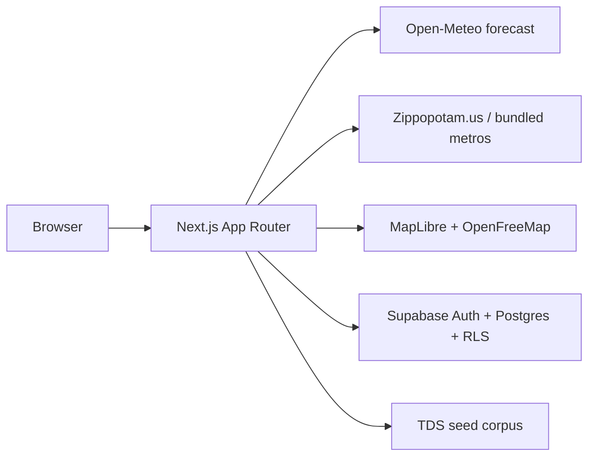

# PainterApps

**Weather. Specs. Jobs.**

Independent tools for professional painters and serious DIYers in the United States. Not affiliated with any paint manufacturer.

Live site: [painterapps.com](https://painterapps.com)


## What it is

1. **PaintDay** — ZIP weather score (0–100) plus a 14-day exterior window.
2. **System Match** — ranked prep + primer + topcoat across manufacturers, each with a TDS citation.
3. **CoverCalc** — gallons / litres from area, porosity, coats, and waste.
4. **News** — coatings desk (weather, specs, regulation, field). You publish in English and Spanish.
5. **Estimating** — Phase 2. Nav and waitlist UI only.

## Architecture



Public tools work **without API keys**. Open-Meteo and the seed TDS corpus are enough for a living demo. Supabase unlocks accounts and saved locations/jobs.

## Local setup

```bash
npm install
cp .env.example .env.local
npm run dev
```

Open [http://localhost:3000](http://localhost:3000).

```bash
npm test          # PaintDay score, System Match, CoverCalc
npm run build
```

### Environment

| Variable | Required? | Purpose |
|---|---|---|
| `NEXT_PUBLIC_APP_URL` | no | Canonical URL |
| `NEXT_PUBLIC_SUPABASE_URL` | for accounts + saved data | Auth + Postgres |
| `NEXT_PUBLIC_SUPABASE_ANON_KEY` | for accounts + saved data | Browser / RLS client |
| `SUPABASE_SERVICE_ROLE_KEY` | seed / news editor writes | Never expose to the browser |
| `NEXT_PUBLIC_MAPBOX_TOKEN` | no | Optional Mapbox styles |
| `NEXT_PUBLIC_POSTHOG_KEY` | no | Product analytics |
| `NEWS_EDITOR_USER_IDS` | to publish from `/app/news` | Comma-separated Supabase user ids |

If Supabase keys are missing, `/login` and `/sign-up` render a finished shell and `/app` redirects to login. PaintDay, Systems, and CoverCalc still work.

## Authentication

Same pattern as FarrarApps and LICA: **Supabase Auth** (email + password). Auth mail goes out through **Brevo**.

1. Site URL: `https://painterapps.com`. Redirect URLs: `https://painterapps.com/auth/callback` and `https://painterapps.com/**`.
2. Auth hook **Send Email** → `https://painterapps.com/api/auth/send-email`. Put the hook secret in `SEND_EMAIL_HOOK_SECRET`.
3. `BREVO_API_KEY`, `BREVO_SENDER_EMAIL` (`hello@painterapps.com`), `BREVO_SENDER_NAME` (`PainterApps`).
4. A trigger on `auth.users` upserts `profiles`. Row Level Security uses `auth.uid()`.

## Database

Apply `supabase/migrations/001_init.sql`, `002_rls.sql`, then `003_news.sql` in the Supabase SQL editor.

```bash
npx tsx scripts/seed.ts
```

The matcher also reads `src/data/tds/corpus.ts` directly, so System Match works with no database.

### Adding TDS data

1. Add the manufacturer, products, and a **system** (prep + primer + topcoat) to `src/data/tds/corpus.ts`.
2. Always include manufacturer name, product name, `tdsRevision`, `tdsDate`, and `tdsUrl`.
3. Re-run `npx tsx scripts/seed.ts` if Supabase is configured.
4. Later: ingest PDFs into `tds_documents` / `tds_chunks` / `tds_embeddings`. Retrieval goes through `src/lib/systems/search.ts` only.

## Coatings news

Public: `/news` and `/news/[slug]`. Landing page teases the latest three.

**Two ways to publish (English + Spanish on every story):**

1. **Editor UI** — `/app/news` after Supabase. Set `NEWS_EDITOR_USER_IDS` to your user id (or `profiles.is_editor = true`). Markdown subset: headings, lists, **bold**, `[links](https://…)`.
2. **Files (optional)** — add an object to `src/data/news/posts.ts` and deploy. The public news page is database-only unless this array has entries. A database row with the same slug replaces the file post.

Stories are independent desk copy. Do not co-brand them as a manufacturer.

## i18n

English and Spanish catalogs live in `src/i18n/messages/en.json` and `es.json`.

- No URL prefix: `/paintday` stays `/paintday`.
- First visit uses `Accept-Language`.
- The **EN | ES** switcher writes the `NEXT_LOCALE` cookie.
- Logged-in profiles store `locale` for a later sync.

When you add UI copy, add the key to **both** files. Spanish should read like a tradesperson wrote it, not a dictionary.

## Weather

`src/lib/weather` is the only place that talks to a forecast API.

- Provider: Open-Meteo (no key).
- Fallback: deterministic demo provider so the map is never empty.
- Scoring: `src/lib/paintday/score.ts` (weights documented, unit-tested).
- Cache: Next.js `unstable_cache` for 45 minutes per ZIP. Optional `weather_cache` table.

Geocoding: bundled US metros, then [Zippopotam.us](https://api.zippopotam.us), then Open-Meteo geocoding for city names. US only in this MVP.

National map: a designed US score field (projected city markers, hover pills, click-through to ZIP). Set `NEXT_PUBLIC_MAPBOX_TOKEN` when you want to swap in Mapbox/MapLibre street styles later — `maplibre-gl` is already a dependency.

## Deploy to Vercel

The repo is Vercel-ready (App Router, no special `vercel.json` required).

1. Import the Git repository.
2. Set environment variables from `.env.example`.
3. Attach the `painterapps.com` domain in the Vercel project.
4. Apply SQL migrations to the production Supabase project.
5. Run the seed script against production once.

## Brand rules

- Never co-brand the chrome as Sherwin-Williams, PPG, Behr, Benjamin Moore, or any other manufacturer.
- Always show manufacturer + product + TDS revision/date + citation link on system cards.
- Disclaimer on `/systems`: guidance only, not a warranty.

## Screenshots

Drop PNGs into `docs/screenshots/`:

- `paintday.png`
- `systems.png`
- `calc.png`
- `landing.png`
